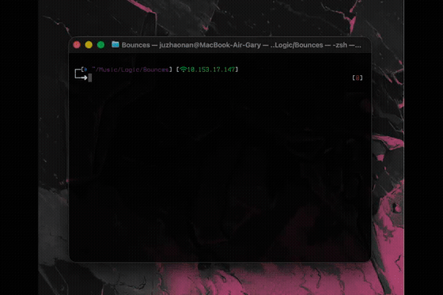

# TMus

终端（TUI）音乐播放器。在任意文件夹输入 `tmus`，即可浏览当前目录与子目录并播放
本地音频（mp3 / flac / wav / m4a…，含 32-bit FLAC），播放时显示实时频谱可视化
（频谱柱 / 波形 / 环形频谱，可自定义颜色）。发行包内置静态 ffmpeg，普通用户无需额外安装。

## 演示

<p align="center">
  
</p>

---

## 安装

> 发行包下载：GitHub Releases → 选择平台 zip：
> macOS（Apple 芯片 `TMus-macos-arm64.zip` / Intel `TMus-macos-x86_64.zip`）、
> Windows（`TMus-windows-x86_64.zip`）。

### macOS 端

**方式一（推荐）：安装脚本，自动处理一切**

```bash
# 解压后进入该目录
cd ~/Downloads/TMus-macos-arm64          # 换成你的解压路径
./install.sh
```

脚本会自动完成：
1. 把 `tmus` 安装到 `~/.local/bin`（并自动加入 PATH，新开终端生效）
2. **ffmpeg 自动检测**：
   - 系统已有 ffmpeg（PATH 或 Homebrew）→ 直接使用系统版，**不复制**内置文件
   - 系统没有 → 自动安装发行包内置的静态 ffmpeg
3. 首次运行如被 Gatekeeper 拦截：访达右键 `tmus` →「打开」

**方式二：手动安装**

```bash
mkdir -p ~/.local/bin
cp tmus ffmpeg ~/.local/bin/        # 已有系统 ffmpeg 时可只拷 tmus
# 确认 ~/.local/bin 在 PATH 中；没有则在 ~/.zshrc 加一行 export PATH="$PATH:$HOME/.local/bin"
```

### Windows 端

**方式一（推荐）：安装脚本**

解压后，右键 `install.ps1` →「使用 PowerShell 运行」（或在该目录执行
`powershell -ExecutionPolicy Bypass -File .\install.ps1`）。脚本自动完成：
1. 把 `tmus.exe` 装到 `%LOCALAPPDATA%\tmus` 并加入用户 PATH
2. **ffmpeg 自动检测**：系统已有（PATH 中）→ 使用系统版；没有 → 安装内置 `ffmpeg.exe`

**方式二：免安装直接玩**

解压后双击 `tmus.exe` 即可（不会写 PATH，仅当前文件夹可用；建议用 Windows Terminal，
程序已自动把控制台切到 UTF-8）。

### ffmpeg 的处理逻辑（重要）

tmus 找 ffmpeg 的优先级（越高越优先）：

1. 环境变量 `TMUS_FFMPEG=/路径`（强制指定）
2. 与 `tmus` **同目录**的 `ffmpeg`（发行包内置那份）
3. 常见安装位置（Homebrew 等）
4. 系统 PATH 中的 `ffmpeg`

所以：
- **用户已有 ffmpeg**：安装脚本检测到后会直接使用系统版、不复制内置文件（省 ~45MB 磁盘）；手动安装时也只拷 `tmus` 即可
- **用户没有**：脚本自动放一份内置静态 ffmpeg 到同目录
- 两种情况程序都能工作，只是来源不同；想强制用某个 ffmpeg 就设 `TMUS_FFMPEG`

### 从源码构建（可选）

```bash
brew install ffmpeg        # Windows: winget install ffmpeg
cargo build --release
./target/release/tmus
```

---

## 使用方法

```bash
cd ~/Music/专辑名        # 进入任意文件夹
tmus                    # 播放当前目录
tmus ~/Music/某目录     # 或直接指定目录
```

| 按键 | 功能 |
| --- | --- |
| `↑/↓` / `j` `k` | 移动选择 |
| `Enter` | 播放曲目 / 进入目录 |
| `Backspace` / `h` | 返回上级目录 |
| `Space` | 播放 / 暂停 |
| `n` / `p` | 下一首 / 上一首 |
| `←` / `→` | 快退 / 快进 5 秒 |
| `v` | 切换可视方式：频谱柱 / 波形 / 环形频谱 |
| `c` | 循环配色预设（光谱/霓虹/森绿/火焰/冰蓝/云白） |
| `C` | 自定义颜色（输入 `#rrggbb`，Enter 确认） |
| `q` | 退出 |

- 可视化/配色设置自动保存到 `~/.config/tmus/config.json`（Windows：`%APPDATA%\tmus\config.json` 同目录结构），删除该文件即可恢复默认
- 界面：路径 → 状态（样式/配色）→ 文件列表 → 进度条 → 可视化区 → 帮助提示

---

## 技术栈

- **语言**：Rust（edition 2021）；发布配置 `strip = true` 精简二进制体积
- **终端界面**：ratatui 0.29（基于 crossterm 后端）+ crossterm 0.28（raw mode、键盘事件、备用屏幕）
- **音频输出**：cpal 0.15 —— 直接对接系统音频 API（macOS CoreAudio / Windows WASAPI / Linux ALSA 等），自动选用默认输出设备，兼容 F32 / I16 / I32 / U16 采样格式
- **音频解码**：外部 ffmpeg 子进程（发行包内置官方静态版），支持 mp3 / flac / wav / m4a / aac / ogg / opus / wma / ape 等，含 32-bit FLAC
- **设置持久化**：serde_json（可视化样式与配色 → `config.json`）
- **Windows 适配**：windows-sys —— 启动时把控制台输出切到 UTF-8（代码页 65001），保证中文与界面字符不乱码
- **CI / 分发**：GitHub Actions 矩阵构建（macOS 原生 arm64 + 交叉编译 x86_64、Windows x64），随发行包内置静态 ffmpeg，用户免安装依赖

## 工作原理

### 1) 播放管线（解码 → 内存 → 声卡）

1. 选曲后**后台线程**调用 ffmpeg，把任意输入统一转码为「设备采样率 / 立体声 16-bit PCM」WAV（参数 `-vn -ac 2 -ar <设备采样率> -c:a pcm_s16le`），落到系统临时目录，**用完即删**
2. tmus 自行解析 WAV 头并校验（兼容 `fmt=1` 与 `WAVE_FORMAT_EXTENSIBLE`），把整曲样本读入内存（`Arc<Vec<i16>>`），并设约 90 分钟的内存上限保护
3. 主线程通过 **mpsc 通道**收到解码结果后交给常驻的 cpal 输出流：**声卡回调只按播放位置从共享内存取样本**写入缓冲区（多余声道自动降混），不做任何重活，播放与解码互不阻塞

> 因此换歌无停顿；代价是整曲一次性载入内存 —— 超过约 90 分钟的长音频会提示暂不支持。

### 2) ffmpeg 定位优先级

`TMUS_FFMPEG` 环境变量（强制指定）→ 与 `tmus` 同目录（发行包内置那份）→ 常见安装位置（Homebrew 等）→ 系统 PATH。

### 3) 界面与事件循环

六区布局：路径 → 播放状态（样式/配色）→ 文件列表 → 进度条 → 可视化区 → 帮助提示。主循环以约 **30fps** 重绘；解码在后台线程完成，UI 轮询非阻塞通道，不卡界面。

### 4) 三种可视化的原理

- **频谱柱**：取播放位置附近的 2048 帧做单声道降混，按**对数分布频段**（约 40Hz → 采样率×0.45）逐列做**单点 DFT**，能量经峰值保持（缓慢衰减 + 平滑）后映射为柱高
- **波形**：直接从时域采样取点画示波线，反映真实声波形态
- **环形频谱**：频段按角度环绕排布，各方向幅度决定半径
- **配色**：6 套内置渐变预设（光谱/霓虹/森绿/火焰/冰蓝/云白）+ 自定义 `#rrggbb`（自动生成明暗渐变）

### 5) 设置持久化

样式与配色的每次切换即时写入 `config.json`（macOS/Linux：`~/.config/tmus/config.json`；Windows：`%APPDATA%\tmus\config.json`），启动时自动加载，删除该文件即恢复默认。

---

## 卸载

推荐直接用发行包里的卸载脚本（会自动探测程序位置、PATH 痕迹、配置，一键清理）：

```bash
# macOS（在解压目录）
./uninstall.sh          # 交互确认；./uninstall.sh -y 全自动
# Windows（在解压目录）
powershell -ExecutionPolicy Bypass -File .\uninstall.ps1    # 或加 -Yes 免确认
```

也可手动删除：

### macOS

```bash
rm -f ~/.local/bin/tmus ~/.local/bin/ffmpeg    # 删程序（Homebrew 装的 ffmpeg 请用 brew uninstall ffmpeg）
rm -rf ~/.config/tmus                          # 删设置
rm -f /tmp/tmus-*.wav                          # 清理解码残留
command -v tmus                                # 应无输出 = 卸载干净
```

如果安装脚本改过 PATH（`~/.zshrc` 里 `export PATH=...tmus` 那两行），一并删除。

### Windows

```powershell
Remove-Item -Recurse -Force "$env:LOCALAPPDATA\tmus"   # 删程序目录
# 移除 PATH 中的 %LOCALAPPDATA%\tmus：
$p = [Environment]::GetEnvironmentVariable('Path','User')
[Environment]::SetEnvironmentVariable('Path', ($p -split ';' | Where-Object { $_ -ne "$env:LOCALAPPDATA\tmus" }) -join ';', 'User')
```

---

## 常见问题

- **找不到 ffmpeg**：把 `ffmpeg`/`ffmpeg.exe` 放到 `tmus` 同目录，或设 `TMUS_FFMPEG`，或安装后重跑安装脚本
- **macOS 首次打不开**：右键 `tmus` →「打开」（个人项目未公证）
- **Windows 提示 SmartScreen**：点「更多信息 → 仍要运行」
- **显示乱码/方块**：请用 Windows Terminal（推荐）；tmus 会自动切换 65001 代码页
- **>90 分钟的长音频**：当前版本整曲载入内存，超长约 90 分钟会提示不支持

---

## 开源协议

本项目基于 [MIT License](LICENSE) 开源，欢迎使用、修改与分发。
